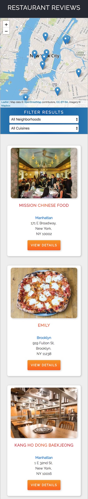
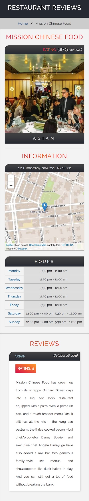
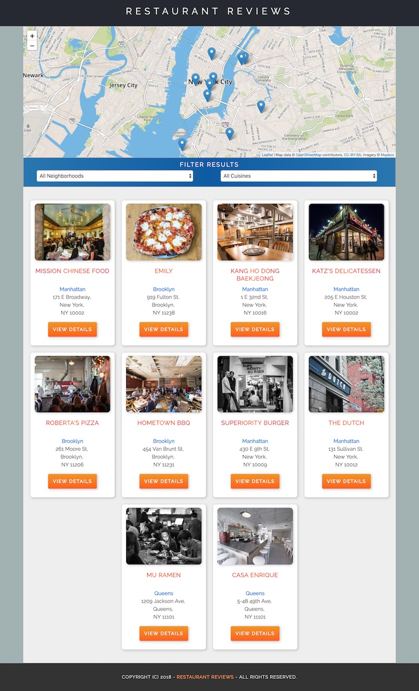
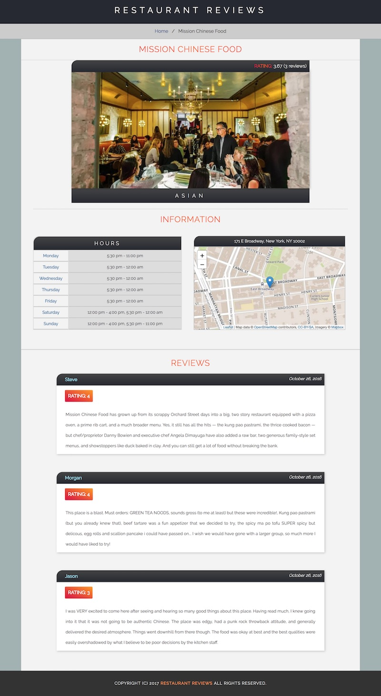

# Restaurant Reviews App

#### _Three Stage Course Material Project - Restaurant Reviews_

## Project Description

This Restaurant Reviews app is a project made for the completion of the [Udacity's Front-End Web Developer Nanodegree](https://www.udacity.com/course/front-end-web-developer-nanodegree--nd001?v=fe1).

## Instructions

Convert a static webpage with no accessibility to a mobile-ready web application responsive on different sized displays and accessible for screen reader use. Add a service worker to begin the process of creating a seamless offline experience for the users.

## How to start

1. Clone or download the repository;

2.  In the terminal, cd into the root folder, and input the command `$ npm install` to install the dependencies.

3. Get a [Mapbox](https://www.mapbox.com/) key by registering on the website. Mapbox is free to use, and does not require any payment information.

4. Go to the `mapbox_new_key` folder and open the file `config.js`. Replace `YOUR_API_KEY` with your key keeping it within single or double quotes.

5. Move the `config.js` file into the `app` folder.

6. In the terminal, check your python version by inputing the command `python -V`. If you have Python 2.x, start the server with  `python -m SimpleHTTPServer 8000`. For Python 3.x, you can use `python3 -m http.server 8000`. If you don't have Python installed, navigate to Python's [website](https://www.python.org/) to download and install the software.

7. Visit http://localhost:8000 on your browser.

8. Alternatively, run the command `$ gulp serve`. The app will open in the browser automatically.

## Project overview

The **responsive design** has been implemented by using CSS, Sass, media queries and Flexbox. The projects has also full **accessibility** with the implementation of the WAI-ARIA specifications.

The app displays data related to a series of restaurants fetched from a local JSON file. The app has two pages: 
1. the first one is the home page, which displays multiple restaurants; 
2. the second one contains detailed information about the restaurant selected from the home page. 

The homepage and each restaurant page have a **Mapbox map** where the exact location of the restaurants is shown. In the main page, it is possible to filter the restaurants by neighborhood and cuisine type, and to select one restaurant among the filtered results to see more detailed information about it. Each restaurant page contains the name, a picture, the hours, the address, the reviews and the rating (average and review-specific) of the restaurant selected.

A **service worker** is used to cache the requests to all of the site’s assets, so that any page that has been visited by a user will be accessible when the user is offline.

## Mobile version

 

## Desktop version

## Dependencies:

* [Leafletjs](https://leafletjs.com/);
* [Mapbox](https://www.mapbox.com/);
* [Gulp](https://gulpjs.com/);
* [Gulp-Sass](https://www.npmjs.com/package/gulp-sass);
* [Browser-Sync](https://browsersync.io/);
* [Google Fonts](https://fonts.google.com/)
